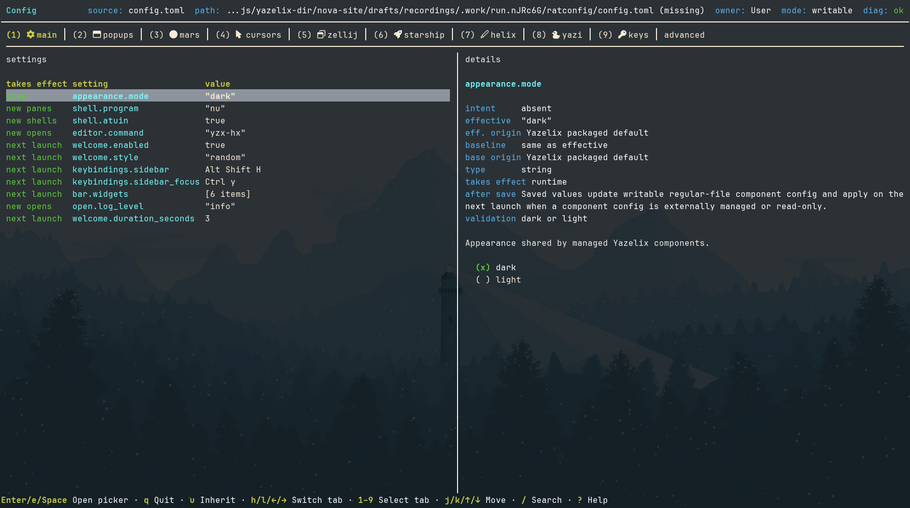

## Note from Lucca Huguet

I've been busy building. And working. I plan to write more in the future.
But today, let's talk about Nova.

Yazelix Nova is delicious to use. Persistent popups per tab let you summon
`lazygit` (or any program you like!), your agent CLI (I use Codex), or Ratconfig (your favorite config TUI)
with a single keystroke. The main `Alt Shift H/J/K/L` layer takes full advantage
of our modal-editing muscle memory.

If you use Yazelix every day, your speed will advance with it! Invest in it.
It's worth it. It has certainly done wonders for my productivity.

I'm blessed to use and improve it every day. It took a few years of
experimenting with Yazelix Classic to find the correct boundaries across the
Yazelix modules and healthier ways to build Yazelix. I accumulated important
guidance and rules, most of which are now crystallized in
[Yazelix/Starcompass](https://github.com/Yazelix/starcompass). And yet here we
are: better than Yazelix Classic in every single way, with 75% less code and
much easier maintenance.

This is just Nova v1, and v2 will be even better.

If you'd like to join the fun, try it. Open issues or discussions, criticize
the project, and tell me what you love about it.

<aside class="article-callout funding-callout" aria-labelledby="fund-nova">
<h3 id="fund-nova">Fund Nova</h3>
<p>Nova takes sustained work. If it saves you time, <a href="https://github.com/sponsors/luccahuguet">sponsor my work on GitHub</a>. Your sponsorship gives me more time to maintain Nova and build v2.</p>
</aside>

With that, I hand it to my coworker, Sol, to explain the details.

> **Try Nova:** `nix profile add --refresh github:Yazelix/nova/stable`, then run `yzx launch` or `yzx enter`.  
> Replace `stable` with `main` for accepted updates or `edge` for experimental dogfood.

## How Nova fits together

*Written by GPT-5.6-Sol with xhigh reasoning.*

Yazelix Nova v1 gives Nix users a packaged terminal workspace built around
Mars, Nova Zellij, Yazi, and Nova Helix. The `yzx` command prepares the runtime,
opens the workspace, and keeps product policy in one place. The selected
package provides the file sidebar, work panes, popup tools, and guided tutor.

A Nix lock file or immutable `nova-v*` tag keeps the selected source revision
fixed. You can carry that revision to another supported machine without
assembling each integration by hand. The Mars-free package brings the managed
TUI to another capable terminal or an SSH session.

> **Before you start:** Nova requires Nix with flakes enabled. Linux is the
> dogfooded platform. Use `yzx enter` over SSH or when you want the host terminal
> to retain control of graphics, clipboard behavior, and notifications.


*The accepted Nova v1 workspace capture shows the Edge channel with Ratconfig,
Mars, and Starcompass project tabs.*

## One front door

| Command | Result |
| --- | --- |
| `yzx launch` | Opens Mars, then starts the managed Zellij workspace |
| `yzx enter` | Starts the same workspace in the current terminal or over SSH |
| `yzx config` | Opens the Ratconfig configuration UI |
| `yzx doctor` | Checks the runtime setup without opening Mars or Zellij |
| `yzx tutor begin` | Starts the packaged tour |

The default layout keeps Yazi beside stacked work panes. Nova extends the
familiar `h`, `j`, `k`, and `l` motion grid across panes and tabs. An
`Alt Shift` layer opens the sidebar, Git client, configuration UI, and coding
agent. The command palette and full Yazi popup stay available from their own
keys.

Nova makes efficient use of screen space. Stacked work panes keep each task
large, and the sidebar can collapse. Tools open in near-fullscreen popups;
`Alt Shift F` gives one pane the full workspace. On a 13-inch laptop, the
active task gets most of the display. On a large monitor, the same layout
feels even roomier.

Mars provides the closest desktop integration. `yzx enter` keeps Zellij, Yazi,
the selected editor, shell setup, and Nova configuration while the host
terminal retains control of graphics, clipboard behavior, and notifications.

## One owner per concern

Nova assigns each concern to one owner:

| Owner | Boundary |
| --- | --- |
| Nova repository | Nix package graph, `yzx`, root config, managed integration, and product policy |
| Mars | Desktop terminal |
| Nova Zellij | Multiplexing and the managed session surface |
| Nova Helix | Packaged editor and workspace bridge |
| Yazi | Native file-manager behavior |
| Zellij Pane Orchestrator | Tab workspace roots and pane coordination |
| Ratconfig | Terminal configuration interface |

Nova pins package outputs and leaves component implementations in their owner
repositories. The maintainers removed Classic's overlapping runtime and
maintenance layers. In the
[fixed v1.0.0 scorecard](https://github.com/Yazelix/nova/blob/da60dc7a855048edabe9706207d4f0721ed3c0a8/README.md#nova-vs-classic),
they counted 23,272 lines of code and configuration in Nova against 91,545 in
Classic, a 75 percent reduction.

Existing Classic users can translate mutable Classic settings through the
frozen migration bridge:

```sh
nix run github:Yazelix/nova/v17.12#yazelix -- launch
```

The bridge reads Classic `settings.jsonc` or `config.toml` files. It does not
rewrite Home Manager declarations. Users whose Classic settings match the
packaged defaults can move straight to Stable.

You see the ownership split during normal work. Yazi can open a file in the
managed Helix pane without inventing another workspace root. The pane
orchestrator keeps one root per tab, and an `Alt z` action can retarget that
root. Git and agent popups receive the same tab-owned path.

## Sessions keep the live workspace

Plain `yzx launch` and `yzx enter` create independent sessions. Add a name when
you want a workspace you can find again:

```sh
yzx enter --session project
yzx launch --session project
```

Attach to a live session by its full name:

```sh
yzx enter attach project
yzx launch attach project
```

Packaged Zellij owns creation, attachment, switching, and process lifetime.
Attachment preserves the target's tabs, panes, processes, working directories,
and Yazi-to-Helix routes. `Ctrl Alt o`, then `w`, opens the native session
manager inside Nova.

The agent toggle and `Alt h` / `Alt l` can stop responding after a session
switch. Press `Alt 1-9` to select a tab, then retry the shortcut.

## Configuration stays sparse

Nova stores semantic overrides under `~/.config/yazelix/config.toml`. Missing
fields inherit packaged defaults, so an update can carry new defaults without
rewriting a large generated file. Component-owned files live under the same
`~/.config/yazelix/` root when you choose to create them.

A user-owned file can stay small:

```toml
[appearance]
mode = "dark"

[shell]
program = "fish"

[editor]
command = "nvim"
```

The example selects three independent overrides. Omit any field to inherit its
packaged default.

`yzx config` presents common settings and routes native settings to their
owner's file. The Home Manager module follows the same boundary: it installs a
selected package, writes the values you declare, and leaves other config files
absent.



*Ratconfig separates inherited values from user intent. See the
[Ratconfig key contract](https://github.com/Yazelix/nova/blob/da60dc7a855048edabe9706207d4f0721ed3c0a8/README.md#ratconfig).*

Eight package variants compose three optional capabilities: Mars, managed
Helix, and managed Yazi. A Mars-free package keeps `enter`; a Helix-free package
uses your configured host editor; a Yazi-free package uses matching host
`yazi` and `ya` commands.

## The v1 release line

[Nova 1.0.0](https://github.com/Yazelix/nova/releases/tag/nova-v1.0.0)
promoted the dogfooded beta.5 runtime under a stable identity. The release
tag resolves to exact revision
[`a5cd038a4acf11d24bca0b328043c61fa1712182`](https://github.com/Yazelix/nova/commit/a5cd038a4acf11d24bca0b328043c61fa1712182)
and keeps the accepted workspace, session, Yazi, Helix, popup, and channel
contracts.

[Nova 1.1.0](https://github.com/Yazelix/nova/releases/tag/nova-v1.1.0)
adds managed Atuin 18.16.1 history for Nushell, Bash, Zsh, and Fish. `Ctrl+r`
opens contextual history search while Up-arrow keeps the shell's native
history. Nova leaves Atuin accounts, sync, daemons, and native configuration
with Atuin. Atuin stores captured commands on the local machine. Review its
privacy filters before capturing commands from sensitive directories. The
1.1.0 tag and Stable branch resolve to exact revision
[`da60dc7a855048edabe9706207d4f0721ed3c0a8`](https://github.com/Yazelix/nova/commit/da60dc7a855048edabe9706207d4f0721ed3c0a8).

Stable is the checked release channel. Main carries accepted updates, and Edge
carries experimental dogfood. Immutable `nova-v*` tags select an exact release.

## Platform boundary

The maintainers dogfood the full Linux path. Nova exposes all eight package
variants for Linux and Darwin on x86_64 and aarch64. CI builds the packages and
Home Manager activation on a real aarch64-darwin runner. Interactive macOS
workflows and the Mars GUI still lack the complete verification that Linux
receives. We also have active users dogfooding Nova on macOS every day.

The SSH path starts with `yzx enter`. Nova guarantees its managed TUI and
configuration there. Your host terminal owns clipboard integration, image
previews, cursor shaders, and desktop notifications.

## Start with Stable

Install the checked channel with Nix flakes enabled:

```sh
nix profile add --refresh github:Yazelix/nova/stable
yzx launch
```

Try the workspace without a profile install:

```sh
nix run github:Yazelix/nova/stable -- launch
nix run github:Yazelix/nova/stable#yazelix-no-mars -- enter
```

Run `yzx tutor begin` after launch. The [Nova Start guide](/start/) covers
channels, package choices, sessions, and first steps. The
[runtime model](/docs/runtime-model/) maps the owners behind the workspace, and
the [customization guide](/docs/customization-surfaces/) lists the supported
configuration surfaces.

## Source record

The site maintainer checked this article on August 19, 2026, against the public
Stable revision
[`da60dc7a855048edabe9706207d4f0721ed3c0a8`](https://github.com/Yazelix/nova/tree/da60dc7a855048edabe9706207d4f0721ed3c0a8),
the [Nova architecture](https://github.com/Yazelix/nova/blob/da60dc7a855048edabe9706207d4f0721ed3c0a8/ARCHITECTURE.md),
the [installation contract](https://github.com/Yazelix/nova/blob/da60dc7a855048edabe9706207d4f0721ed3c0a8/docs/installation.md),
the [configuration contract](https://github.com/Yazelix/nova/blob/da60dc7a855048edabe9706207d4f0721ed3c0a8/docs/configuration.md),
and the public 1.0.0 and 1.1.0 release records linked above.

<aside class="article-end-cta" aria-labelledby="try-nova-today">
<h2 id="try-nova-today">Try Nova</h2>
<p>Start with Stable, then tell us what helps and what gets in your way.</p>
<div class="hero-actions">
<a class="button primary" href="/start/">Start with Nova</a>
<a class="button secondary" href="https://github.com/sponsors/luccahuguet">Fund Nova</a>
</div>
</aside>
